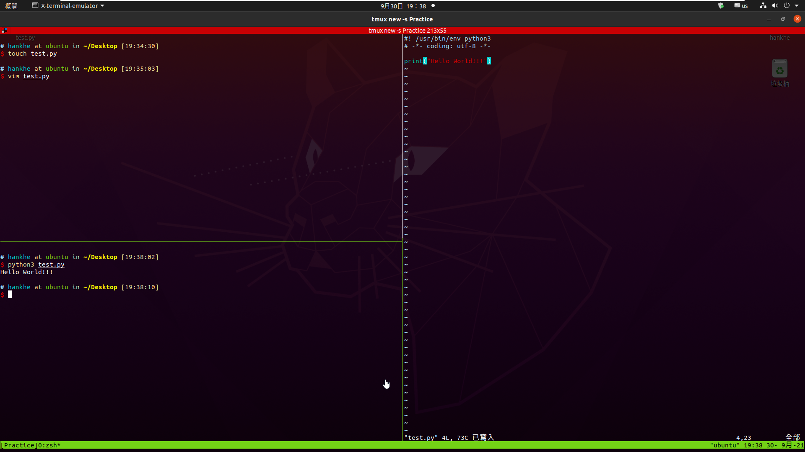
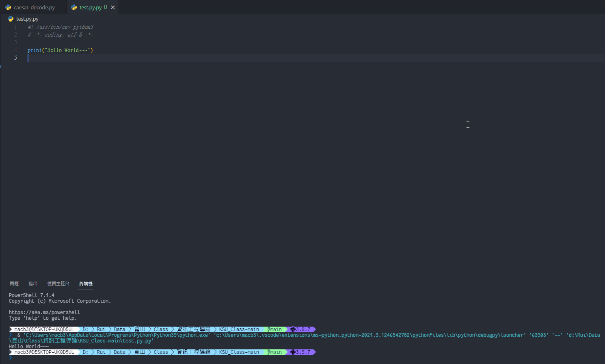
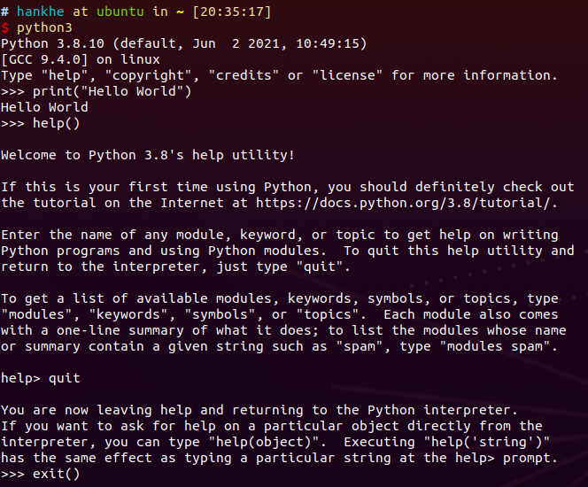
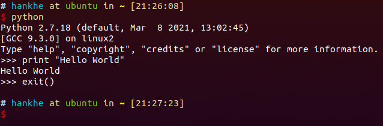
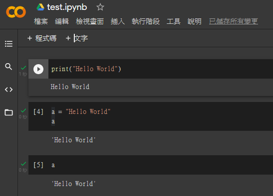

# python開發環境
- python有許多開發環境與IDE(Pycharm, spyder, VSCode,...)
- 我通常都是使用(個人習慣)：
   - linux(Ubuntu) => vim or VSCode
      
   - Win10 => VSCode
      
- 其他請參閱Google或書籍
   - 如Windows python程式開發

## linux python-互動模式
### python3 [持續發展中, 學習python的重心]
- \>>> [ your_python_code ]
- help() => 在這個模式下可以輸入 python3 各種套件的名稱來查看該套件的文檔
   - quit => 退出 help() 模式
- \>>> exit() => 退出 python 互動模式



### python2 [已經不再更新, 但仍有些套件使用]
- python2 在使用 print() 的時候可以不需要 () 直接加想輸出的字串



## linux python-標準模式
- 使用vim
   ```shell
   vim XXX.py => 編輯 or 創建 python 檔
   python3 XXX.py => 執行程式(python3)
   python XXX.py => 執行程式(python2)
   ```

# [2]使用Goolge Colab 平台開發python程式
- 恩師推薦
- 免費的Jupyter Notebook環境
- 在雲端中運行
- 用這個環境附檔名不是 [.py] 是 [.ipynb]



## 開始動手
### init
- Google 搜尋 Google Colab ==> 即可找到連結
   - ==> 點選連結 需先登入(建議使用Google 帳號登入)
   - ==> 出現選擇 檔案來源畫面 時 先按取消

### 使用 Google 免費的 GPU
- 執行階段 -> 變更執行階段類型 -> 硬體加速器 -> 選 GPU
- 查看 GPU 型號
   ```shell
   !nvidia-smi
   ```

### 範例:查看重要 Google Colab已安裝的重要套件版本[先不要解釋內容]
- 將底下程式碼貼到cell
- ctrl + Enter 即可執行
```
import pandas as pd
print("pandas version: %s" % pd.__version__)
 
import matplotlib
print("matplotlib version: %s" % matplotlib.__version__)
 
import numpy as np
print("numpy version: %s" % np.__version__)
 
import sklearn
print("scikit-learn version: %s" % sklearn.__version__)
 
import tensorflow as tf
print("tensorflow version: %s" % tf.__version__)
 
import torch
print("PyTorch version: %s" %torch.__version__)
print("2021年4月PyTorch version最新版本 請參閱https://pytorch.org/")
```

### 範例:已安裝的pyhon套件與版本 [要有 驚嘆號 !]
```
!pip list
```
